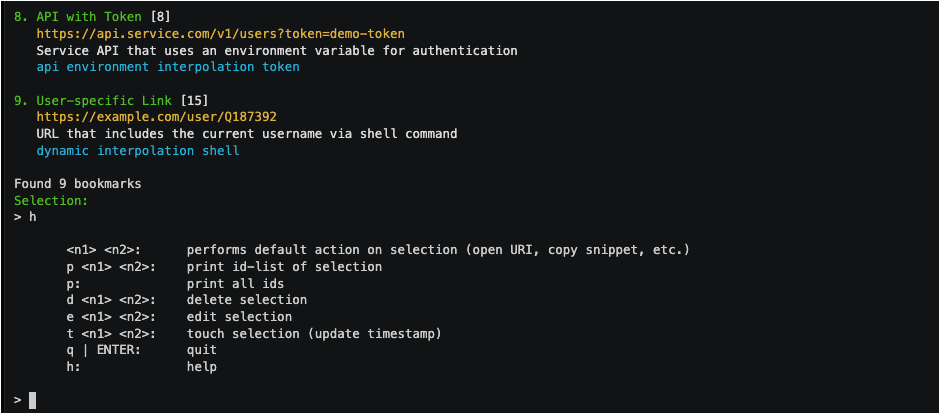
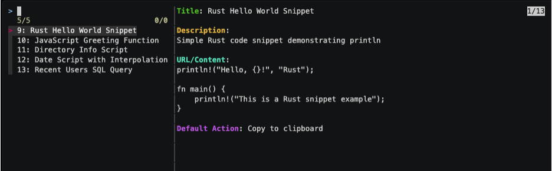

# bkmr


[](https://docs.rs/bkmr)
[![Build Status][build-image]][build-url]

# Beyond Bookmarks and Snippets: A CLI Knowledge Management System

[bkmr reborn](https://sysid.github.io/bkmr-reborn/)

`bkmr` - selected [crate of the week 482](https://this-week-in-rust.org/blog/2023/02/15/this-week-in-rust-482/) - is a fast, feature-rich command-line tool that extends far beyond traditional bookmark management.

**Organize**, **find**, and **apply** your various content types:

- Web URLs with automatic metadata extraction
- Code snippets for quick access and reuse
- Shell commands with execution capabilities
- Markdown documents with live rendering
- Plain text with template interpolation
- Local files and directories
- Semantic embeddings for AI-powered search

## Why bkmr?

- **Developer-focused**: Integrates seamlessly with your workflow and toolchain
- **Multifunctional**: Handles many content types with context-aware actions
- **Intelligent**: Full-text and semantic search capabilities
- **Privacy-focused**: Local database, no cloud dependencies unless enabled
- **Fast**: 20x faster than similar Python tools

## Core Features

```bash
# Quick fuzzy search across your content with interactive selection
bkmr search --fzf

# Advanced filtering with tags
bkmr search -t python,security "authentication"

# Add web URLs, enrich with metadata automatically
bkmr add https://example.com tag1,tag2  # title, description, etc will be loaded automatically

# Store code snippets
bkmr add "SELECT * FROM users WHERE role = 'admin'" sql,snippet --type snip --title "My Sql"
bkmr search --fzf --fzf-style enhanced -t _snip_  # show interactive selection menu

# shell scripts, added via interactive editor
bkmr add sysadmin,utils --type shell
# Bookmark Template
# Lines starting with '#' are comments and will be ignored.
# Section markers (---SECTION_NAME---) are required and must not be removed.

---ID---

---URL---
#!/bin/bash
echo "Hello World!"
---TITLE---
System Status
---TAGS---
_shell_
---COMMENTS---
Show the system status
---EMBEDDABLE---
false
---END---

# Run the script (default action for this content-type is called automatically when search returns exactly one)
bkmr search -t _shell_ "System Status"
> Found 1 bookmark: System Status (ID: 22). Executing default action...
> Execute: #!/bin/bash
echo "Hello World!"
# Edit the command if needed, press Enter to execute, or Ctrl-C to cancel
> Hello World!


# Store markdown which will be rendered in the browser
bkmr add "# Project Notes\n\n## Tasks\n- [ ] Complete documentation\n- [ ] Write tests" notes,project --type md --title Markdown
bkmr open <id>  # open it in WEB browser

# Store environment variables for sourcing in a shell
bkmr add "export DB_USER=dev\nexport DB_PASSWORD=secret\nexport API_KEY=test_key" dev,env --type env --title 'My Environment'
bkmr search --fzf --fzf-style enhanced -t _env_  # select it for sourcing

# Execute shell commands via bookmark (deprecated, use content-type _shell_ instead)
bkmr add "shell::find ~/projects -name '*.go' | xargs grep 'func main'" tools,search --title 'Search Golang'

# Semantic search with AI
bkmr --openai sem-search "containerized application security" --limit 3
```
### Bookmarks


### Snippets


## Demos

See bkmr in action:

- <a href="https://asciinema.org/a/VTsHuw1Ugsbo10EP0tZ3PdpoG?autoplay=1&speed=2&t=3" alt="Overview">Overview</a>

- <a href="https://asciinema.org/a/wpnsTw3Cl7DK2R7jK7WVpp9OR?autoplay=1&speed=2&t=3" alt="Getting Started">Getting Started</a>
- <a href="https://asciinema.org/a/M97UJMKxw1nxnzO4SaowGZAmb?autoplay=1&speed=2&t=3" alt="Search and Filter">Search and Filter</a>
- <a href="https://asciinema.org/a/uCuNPSlqRemlcXiVQ3CIqq8uV?autoplay=1&speed=2&t=3" alt="Edit and Update">Edit and Update</a>
- <a href="https://asciinema.org/a/jNOLfhc6aFV3wPGTgOzgrM7Kc?autoplay=1&speed=2&t=3" alt="Tag Management">Tag Management</a>

## Getting Started

1. **Install:**
   ```bash
   cargo install bkmr

   # or via pip/pipx/uv
   pip install bkmr

   # or via brew
   brew install bkmr

   ```

2. **Setup:**
   ```bash
   # Configuration 
   bkmr --generate-config > ~/.config/bkmr/config.toml

   # Create database
   bkmr create-db ~/.config/bkmr/bkmr.db
   
   # Optional: Configure location (override config.toml)
   export BKMR_DB_URL=~/path/to/db
   ```

3. **Start using:**
   ```bash
   # Add your first bookmark
   bkmr add https://github.com/yourusername/yourrepo github,project
   
   # Find it again
   bkmr search github
   ```

## Command Reference

| Command | Description |
|---------|-------------|
| `search` | Search across all content with full-text and tag filtering |
| `sem-search` | AI-powered semantic search using OpenAI embeddings |
| `add` | Add new content (URLs, snippets, files, shell commands, etc.) |
| `open` | Launch or interact with stored items |
| `edit` | Modify existing items |
| `tags` | View and manage your tag taxonomy |
| `set-embeddable` | Configure items for semantic search |

## Smart Content Actions

`bkmr` intelligently handles different content types with appropriate actions:

| Content Type          | Default Action                        | System Tag   |
|-----------------------|---------------------------------------|--------------|
| URLs                  | Open in browser                       | (none)       |
| Snippets              | Copy to clipboard                     | `_snip_`     |
| Shell Scripts         | Interactive edit then execute in terminal | `_shell_`    |
| Environment Variables | Print to stdout for sourcing in shell | `_env_`      |
| Markdown              | Render and view in browser            | `_md_`       |
| Text Documents        | Copy to clipboard                     | `_imported_` |
| Local Files           | Open with default application         | (none)       |

## Advanced Features

- **Interactive shell editing**: Shell scripts present an interactive editor with vim/emacs bindings before execution
- **Template interpolation**: Use Jinja-style templates in URLs and commands
- **Content embedding**: Store semantic representations for AI-powered search
- **Context-aware actions**: Different behaviors based on content type
- **Multiple output formats**: Terminal display, clipboard, or JSON export

### Shell Script Interaction

Shell scripts (`_shell_` content type) provide an interactive editing experience:

- **Pre-filled editing**: Original script appears ready for modification
- **Vim/Emacs bindings**: Automatically detects your shell's edit mode from `.inputrc`, `$ZSH_VI_MODE`, etc.
- **Parameter support**: Add arguments, modify commands, or combine multiple commands
- **History integration**: Commands are saved to `~/.config/bkmr/shell_history.txt`
- **Configurable behavior**: Can be disabled via configuration for direct execution

```bash
# Interactive mode (default) - edit before execution
bkmr search -t _shell_ "backup script"
Execute: rsync -av /home/user/docs /backup/
# Edit to add parameters: rsync -av /home/user/docs /backup/$(date +%Y%m%d)/
# Press Enter to execute

# Disable interactive mode via configuration
export BKMR_SHELL_INTERACTIVE=false
# or in ~/.config/bkmr/config.toml:
# [shell_opts]
# interactive = false
```

For detailed documentation on advanced features:
- [Configuration Options](./docs/configuration.md)
- [Content Types](./docs/content-types.md)
- [Smart Actions](./docs/smart-actions.md)
- [Template Interpolation](./docs/template-interpolation.md)
- [Semantic Search](./docs/semantic-search.md)
- [Advanced Usage](./docs/advanced_usage.md)

## Developer Workflow Integration

`bkmr` transforms your terminal into a knowledge hub for development tasks:

1. **Unified knowledge store** - Access code snippets, documentation, and resources with one command
2. **Reduced context switching** - Launch applications and execute commands without leaving your workflow
3. **Smart clipboard management** - Quickly access common snippets without leaving the terminal
4. **Documentation at your fingertips** - Render markdown and technical notes instantly
5. **Automation shortcuts** - Turn complex command sequences into reusable bookmarks

## Upgrading from Previous Versions

If you're upgrading from a previous version, `bkmr` will automatically:
1. Check for necessary database migrations
2. Create a timestamped backup of your current database
3. Apply migrations to support newer features

## Community and Contributions

We welcome contributions! Please check our [Contributing Guidelines](./CONTRIBUTING.md) to get started.

<!-- Badges -->
[build-image]: https://github.com/sysid/bkmr/actions/workflows/release_wheels.yml/badge.svg
[build-url]: https://github.com/sysid/bkmr/actions/workflows/release_wheels.yml
