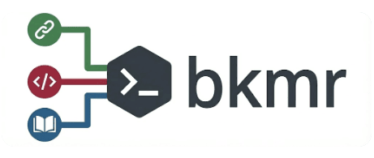
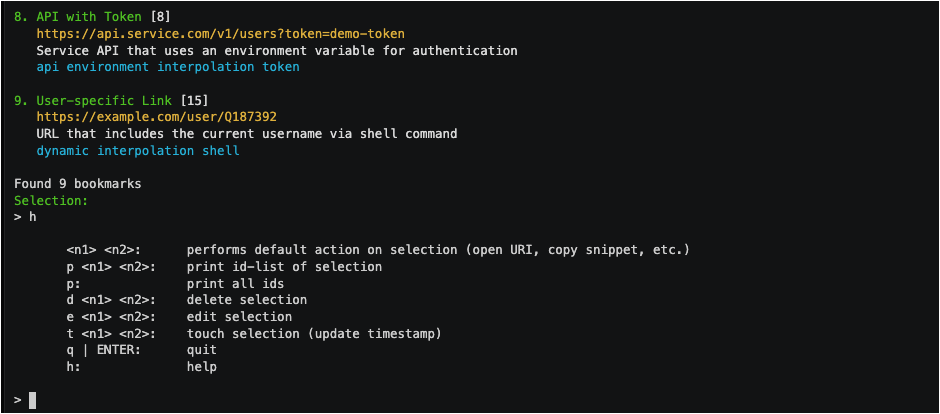
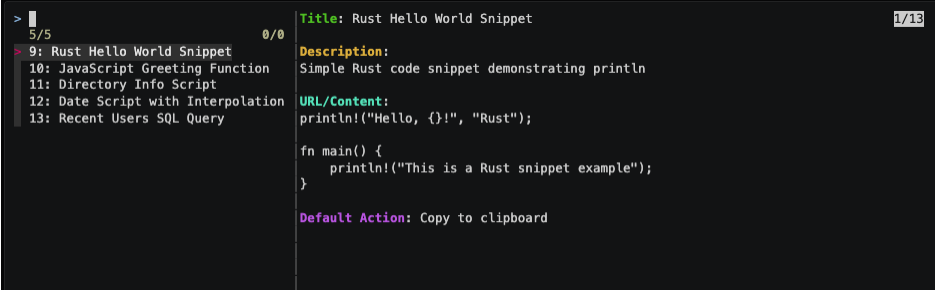

[](https://docs.rs/bkmr)
[![Build Status][build-image]][build-url]

> A local-first memory for humans and AI agents. Store anything, find it by meaning, act on it instantly.

# Beyond Bookmarks and Snippets: Knowledge Management for Humans and Agents

`bkmr` - [crate of the week 482](https://this-week-in-rust.org/blog/2023/02/15/this-week-in-rust-482/) - memories, bookmarks, snippets, etc, searchable, executable.

**Organize**, **find**, and **apply** various content types:

- Web URLs with automatic metadata extraction
- Code snippets for quick access and reuse
- Shell commands with immediate execution capabilities
- Markdown documents with live rendering, incl. TOC
- Plain text with Jinja template interpolation
- Local files and directories integration

**Centralize** your data in bkmr's database (`add`) or **keep it in your filesystem**
(`import-files`) ([see](https://github.com/sysid/bkmr/wiki/File-Import-and-Editing)).

- e.g. memories, bookmarks, links, snippets in database
- large documents or scripts in filesystem, references go into database

**Both options provide the full management capability of `bkmr`.**

## Why bkmr?

- **Developer- and agent-focused**: Integrates seamlessly with workflow and toolchain
- **Agent-friendly**: JSON output, non-interactive mode, and `_mem_` system tag for AI agent memory
- **Multifunctional**: Handles many content types with context-aware actions
- **Intelligent**: Full-text and semantic search capabilities
- **Privacy-focused**: Fully local — database, embeddings, and search all run offline
- **Fast**: 20x faster than similar Python tools
- **Automation-ready**: Programmatic CLI with `--json`, `--np`, `--stdout` for pipelines and integrations

**[Editor Integration](https://github.com/sysid/bkmr/wiki/Editor-Integration)**:
- **Built-in LSP server**: Use `bkmr lsp` for VS Code, Vim, Emacs - automatic snippet completion with language-aware filtering
- **[Neovim Plugin](https://github.com/sysid/bkmr-nvim)**: Visual interface with Telescope integration and zero configuration
- **[IntelliJ Plugin](https://github.com/sysid/bkmr-intellij-plugin)**: JetBrains Marketplace plugin


## Agent Memory and Skill

Persistent long-term memory for AI agents. The `_mem_` system tag and `hsearch` (hybrid FTS + semantic search) create a complete read/write memory interface:

```bash
# Agent stores memory:
bkmr add "Prod DB is PostgreSQL 15 on port 5433" fact,database \
  --title "Production database config" -t mem --no-web

# Agent queries memories with natural language (hybrid search)
bkmr hsearch "database configuration" -t _mem_ --json --np

# All output is structured JSON — designed for programmatic consumption
```

Use [`skill/bkmr-memory`](skill/bkmr-memory/SKILL.md). It defines a complete memory protocol with taxonomy, deduplication, and session workflows.

See **[Agent Integration](https://github.com/sysid/bkmr/wiki/Agent-Integration)** for complete documentation.

## Quick Examples

```bash
# Quick fuzzy search with interactive selection
bkmr search --fzf

# Add URL with automatic metadata extraction
bkmr add https://example.com tag1,tag2

# Store code snippet
bkmr add "SELECT * FROM users" sql,_snip_ --title "User Query"

# Shell script with interactive execution
bkmr add "#!/bin/bash\necho 'Hello'" utils,_shell_ --title "Greeting"

# Render markdown in browser with TOC
bkmr add "# Notes\n## Section 1" docs,_md_ --title "Project Notes"

# Import files with frontmatter
bkmr import-files ~/scripts/ --base-path SCRIPTS_HOME

# Local semantic search (no API keys needed)
bkmr sem-search "containerized application security"

# Agent memory: store and retrieve knowledge
bkmr add "Prod DB on port 5433" fact,database --title "Prod DB config" -t mem --no-web
bkmr hsearch "database config" -t _mem_ --json --np
```

### Screenshots

**Bookmarks:**


**Snippets:**


**Demos:**
- <a href="https://asciinema.org/a/q4Okf4j2ja757Nav5wf0tNz8k?autoplay=1" alt="Never Context-Switch Again"></a>
- [Overview](https://asciinema.org/a/VTsHuw1Ugsbo10EP0tZ3PdpoG?autoplay=1&speed=2&t=3) | [Getting Started](https://asciinema.org/a/wpnsTw3Cl7DK2R7jK7WVpp9OR?autoplay=1&speed=2&t=3) | [Search and Filter](https://asciinema.org/a/M97UJMKxw1nxnzO4SaowGZAmb?autoplay=1&speed=2&t=3) | [Edit and Update](https://asciinema.org/a/uCuNPSlqRemlcXiVQ3CIqq8uV?autoplay=1&speed=2&t=3) | [Tag Management](https://asciinema.org/a/jNOLfhc6aFV3wPGTgOzgrM7Kc?autoplay=1&speed=2&t=3)

## Getting Started

### Installation

```bash
# Via cargo
cargo install bkmr

# Via pip/pipx/uv
pip install bkmr

# Via brew
brew install bkmr
```

See **[Installation Guide](https://github.com/sysid/bkmr/wiki/Installation)** for detailed instructions and troubleshooting.

### Initial Setup

```bash
# Generate configuration
bkmr --generate-config > ~/.config/bkmr/config.toml

# Create database
bkmr create-db ~/.config/bkmr/bkmr.db

# Optional: Configure location
export BKMR_DB_URL=~/path/to/db
```

### First Use

```bash
# Add your first bookmark
bkmr add https://github.com/yourusername/yourrepo github,project

# Search and find
bkmr search github

# Interactive fuzzy search
bkmr search --fzf
```

**Quick Start Guide**: See the **[Quick Start](https://github.com/sysid/bkmr/wiki/Quick-Start)** for a 5-minute tutorial.

## Command Reference

| Command | Description |
|---------|-------------|
| `search` | Full-text search with tag filtering, FZF, JSON output |
| `hsearch` | Hybrid search: FTS + semantic with RRF fusion |
| `sem-search` | Semantic search using local embeddings (offline, no API keys) |
| `add` | Add bookmarks (URLs, snippets, scripts, markdown, env vars) |
| `open` | Smart action dispatch based on content type |
| `edit` | Edit bookmarks (smart: opens source file for imports) |
| `update` | Modify tags and custom openers |
| `delete` | Delete bookmarks by ID |
| `show` | Display bookmark details |
| `import-files` | Import files/directories with frontmatter parsing |
| `tags` | View tag taxonomy with usage counts |
| `info` | Show configuration, database path, embedding status |
| `backfill` | Generate missing embeddings |
| `clear-embeddings` | Clear all embeddings and content hashes |
| `lsp` | Start LSP server for editor snippet completion |
| `completion` | Generate shell completions (bash, zsh, fish) |
| `surprise` | Open random URL bookmarks |

**Complete command documentation**: See **[Basic Usage](https://github.com/sysid/bkmr/wiki/Basic-Usage)** for detailed examples.

## Smart Content Actions

bkmr intelligently handles different content types with appropriate actions:

| Content Type          | Default Action                | System Tag   |
|-----------------------|-------------------------------|--------------|
| URLs                  | Open in browser               | (none)       |
| Snippets              | Copy to clipboard             | `_snip_`     |
| Shell Scripts         | Interactive edit + execute    | `_shell_`    |
| Markdown              | Render in browser with TOC    | `_md_`       |
| Environment Variables | Print for `eval`/`source`     | `_env_`      |
| Text Documents        | Copy to clipboard             | `_imported_` |
| Agent Memory          | Display to stdout             | `_mem_`      |

> **Rule:** A bookmark can have at most **one** system tag. Local files without a system tag open with the default application.

Learn more: **[Content Types](https://github.com/sysid/bkmr/wiki/Content-Types)** | **[Core Concepts](https://github.com/sysid/bkmr/wiki/Core-Concepts)**

## Documentation

Comprehensive documentation is available in the **[bkmr Wiki](https://github.com/sysid/bkmr/wiki)**:

### Getting Started
- **[Home](https://github.com/sysid/bkmr/wiki/Home)** - Wiki overview and navigation
- **[Quick Start](https://github.com/sysid/bkmr/wiki/Quick-Start)** - 5-minute introduction
- **[Installation](https://github.com/sysid/bkmr/wiki/Installation)** - Installation methods and troubleshooting
- **[Core Concepts](https://github.com/sysid/bkmr/wiki/Core-Concepts)** - Understanding tags, system tags, and bookmarks

### Core Features
- **[Basic Usage](https://github.com/sysid/bkmr/wiki/Basic-Usage)** - Common daily operations
- **[Search and Discovery](https://github.com/sysid/bkmr/wiki/Search-and-Discovery)** - FTS, tags, fuzzy finder, semantic search
- **[Content Types](https://github.com/sysid/bkmr/wiki/Content-Types)** - URLs, snippets, shell scripts, markdown, environment variables
- **[Shell Scripts](https://github.com/sysid/bkmr/wiki/Shell-Scripts)** - Interactive execution and shell function stubs

### Advanced Topics
- **[Configuration](https://github.com/sysid/bkmr/wiki/Configuration)** - Complete configuration reference
- **[Template Interpolation](https://github.com/sysid/bkmr/wiki/Template-Interpolation)** - Jinja2 dynamic content
- **[Agent Integration](https://github.com/sysid/bkmr/wiki/Agent-Integration)** - AI agent memory, JSON API, bulk import
- **[File Import and Editing](https://github.com/sysid/bkmr/wiki/File-Import-and-Editing)** - Frontmatter, base paths, smart editing
- **[Semantic Search](https://github.com/sysid/bkmr/wiki/Semantic-Search)** - Local offline semantic search with fastembed
- **[Editor Integration](https://github.com/sysid/bkmr/wiki/Editor-Integration)** - LSP server and editor plugins
- **[Advanced Workflows](https://github.com/sysid/bkmr/wiki/Advanced-Workflows)** - Power user techniques

### Reference
- **[Troubleshooting](https://github.com/sysid/bkmr/wiki/Troubleshooting)** - Common issues and solutions
- **[Development](https://github.com/sysid/bkmr/wiki/Development)** - Contributing and building from source

## Editor Integrations

Access your snippets directly within your editor without context switching.

### Neovim Plugin (Recommended)

**[bkmr-nvim](https://github.com/sysid/bkmr-nvim)** provides visual interface with zero configuration.

```lua
{
  "sysid/bkmr-nvim",
  dependencies = { "nvim-lua/plenary.nvim" },
  config = function()
    require("bkmr").setup() -- Zero config required!
  end,
}
```

**Features**: Visual snippet browser, in-editor editing, automatic LSP setup, custom commands

### Built-in LSP Server

Compatible with VS Code, Vim, Emacs, Sublime, and any LSP-compatible editor.

```bash
# Start LSP server
bkmr lsp

# Disable template interpolation if needed
bkmr lsp --no-interpolation
```

**Features**: Automatic completion, language-aware filtering, universal snippets, template interpolation

### IntelliJ Platform Plugin

**[bkmr-intellij-plugin](https://github.com/sysid/bkmr-intellij-plugin)** for all JetBrains IDEs.

**Features**: Seamless LSP integration, Tab navigation, works in IntelliJ IDEA, PyCharm, WebStorm, CLion, RustRover, and all JetBrains IDEs

**Complete documentation**: **[Editor Integration](https://github.com/sysid/bkmr/wiki/Editor-Integration)**

## Platform Compatibility

**Linux Clipboard**: Uses external tools for reliable clipboard persistence.
- **Wayland**: Uses `wl-copy` from `wl-clipboard` package
- **X11**: Uses `xclip` (preferred) or `xsel` as fallback
- **Auto-detection**: Detects display server via `WAYLAND_DISPLAY` environment variable

## Development

### Building from Source

```bash
git clone https://github.com/sysid/bkmr.git
cd bkmr
cargo build --release
```

### Running Tests

**IMPORTANT**: All tests must be run single-threaded:

```bash
# Run tests (REQUIRED: single-threaded)
cargo test -- --test-threads=1

# Or use Makefile
make test
```

**Why single-threaded?** Tests share a SQLite database and environment variables. Parallel execution causes race conditions.

See **[Development](https://github.com/sysid/bkmr/wiki/Development)** for complete contributor guide.

## Community and Contributions

We welcome contributions! Please check our [Contributing Guidelines](./CONTRIBUTING.md) to get started.

**Resources:**
- GitHub: https://github.com/sysid/bkmr
- Issues: https://github.com/sysid/bkmr/issues
- Wiki: https://github.com/sysid/bkmr/wiki
- Discussions: https://github.com/sysid/bkmr/discussions

<!-- Badges -->
[build-image]: https://github.com/sysid/bkmr/actions/workflows/release_wheels.yml/badge.svg
[build-url]: https://github.com/sysid/bkmr/actions/workflows/release_wheels.yml
